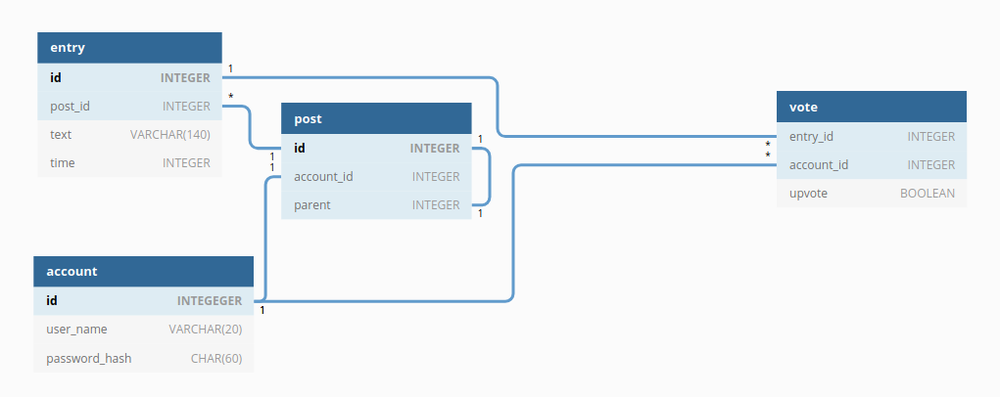

# Värkki

Värkki on yksinkertainen sosiaalisen median palvelu, joka toteuttaa erään XKCD-sarjakuvan esittämän moderaatiomuodon:


Rekistöröitynyt käyttäjä voi lisätä Värkkiin lyhyen markdowninkielisen ja mahdollisesti risuaidalla merkittyjä hakusanoja sisältävän kirjoituksen. Kirjoituksen lähettäminen vaatii kolmen muun kirjoituksen arvioimisen. Jos lisätty kirjoitus saa muilta käyttäjiltä kaksi positiivista arviota kolmesta, se julkaistaan.

Olemassa olevaan kirjoitukseen voidaan sitten vastaavalla tavalla lisätä viisi kommenttia. Sen jälkeen kirjoitus lukkiutuu, eikä siihen voida lisätä uusia kommentteja. Ylätason kirjoitus ja sen kommentit ovat alkuperäisen kirjoittajan poistettavissa ja muokattavissa vaikka kirjoitus olisikin lukkiutunut.

Kirjoituksia ja kommentteja voidaan hakea tekijän ja ajankohdan mukaan. Pysyväislinkit kirjoituksiin ovat pysyviä niin kauan kuin kirjoitusta ei poisteta.

## Tietokantojen rakenteesta

Sovellukseen kuuluu alustavasti tietokantatauluja kirjoituksille, moderaatiota varten ja käyttäjille. Käyttäjille ja kirjoituksille on tarjolla täysi crud-toiminnallisuus. Tietokanta on myös suunniteltu niin, että siitä voidaan poistaa käyttäjän tiedot kokonaan tietosuojan nimissä.



```

/* Käyttäjätietokanta sisältää jokaista käyttäjää kohden tunnuksen ja bcryptin läpi käytetyn salasanan tiivisteen. Tunnus on muutettavissa, joten käyttäjän uniikki tunniste on keinotekoinen primääriavain.
 
 C: Tilin voi luoda
 R: Tiliin voi kirjautua
 U: Tilistä voi vaihtaa salasanan tai tunnuksen
 D: Tili voidaan poistaa. Tällöin kaikki viittaukset tiliin tuhotaan.
 
*/

CREATE TABLE account (
    id INTEGER PRIMARY KEY,
    user_name VARCHAR(20) NOT NULL UNIQUE,
    password_hash CHAR(60) NOT NULL UNIQUE -- Tämän uniikkiusvaatimus on lähinnä sitä varten, että se varoittaa vakavasta ohjelmointivirheestä
);

/* Jokaisesta viestistä säilytetään versiohistoria. entry-taulun rivit ovat tällaisia versioita. post-taulun rivit taas viittaavat viestiketjuihin, jotka viesteistä muodostuvat.
 
 C: Sekä postauksia, että entryjä voi luoda
 R: Postauksia vastaavia entryjä voi lukea, mikäli niillä on riittävä määrä ylä-ääniä
 U: Uusia entryjä voi luoda postauksen tekstin vaihtamiseksi
 D: Postauksen voi poistaa. Tällöin kaikki siihen liittyvät entryt ja äänet tuhotaan

*/

CREATE TABLE entry (
    id INTEGER PRIMARY KEY,
    post_id INTEGER NOT NULL REFERENCES post,
    text VARCHAR(140) NOT NULL,
    time INTEGER NOT NULL
);

CREATE TABLE post (
    id INTEGER PRIMARY KEY,
    account_id INTEGER REFERENCES account, -- Kun vastineen tehnyt käyttäjä poistetaan, tämä saa arvon NULL
    parent INTEGER REFERENCES entry -- Ylätason postauksilla tämä saa arvon null
);

/* Äänitietokanta kertoo sen, kuka on äänestänyt ja mitä. Tavoitteena on estää, että samaa entry-riviä äänestäisi sama henkilö toistuvasti. */

CREATE TABLE vote (
    entry_id INTEGER NOT NULL REFERENCES entry,
    account_id INTEGER REFERENCES account, /* Kun jokin viesti on äänestetty läpi, tämä kenttä saa arvon NULL.
                         Näin käyttäjätilin poistamisen jälkeen voidaan poistaa kaikki äänet,
                         jotka viittaavat siihen niin, ettei sivuilta katoa sisältöä */
    upvote BOOLEAN, /*    Kun jollekulle arvotaan moderoitavaksi entry, tämä kenttä saa arvon NULL kunnes ääni on annettu.
                         Äänen voi antaa vain jos tällainen NULL-upvoteinen ääni löytyy tietokannasta */
    CHECK (account_id IS NOT NULL OR upvote IS NOT NULL)
);

```
