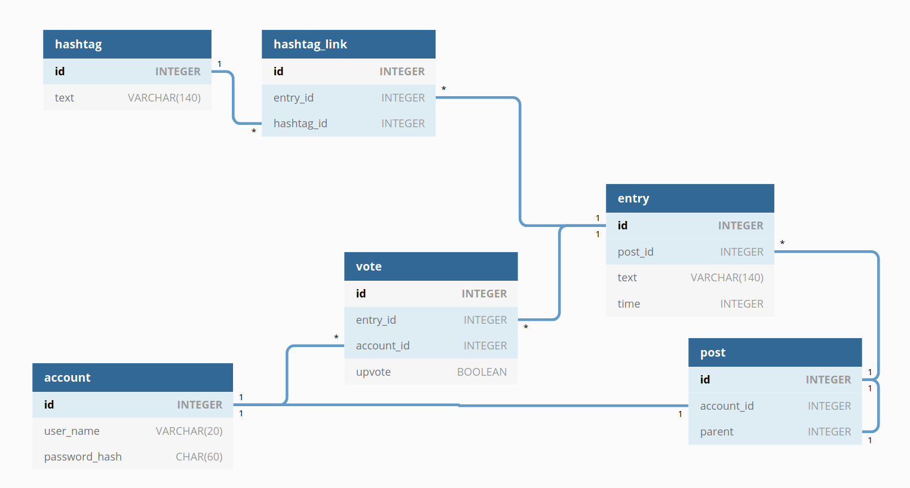

# Tietokantarakenne

## Nykytila

Sovellukseen on toteutettu kaikki alla mainitut taulut lukuun ottamatta mahdollista hakusanataulua.

## Tämän hetkinen suunnitelma

Sovellukseen kuuluu alustavasti tietokantatauluja kirjoituksille, moderaatiota varten ja käyttäjille. Käyttäjille ja kirjoituksille on tarjolla täysi crud-toiminnallisuus. Tietokanta on myös suunniteltu niin, että siitä voidaan poistaa käyttäjän tiedot kokonaan tietosuojan nimissä.



<!--

Table account {
  id INTEGEGER [pk]
  user_name VARCHAR(20)
  password_hash CHAR(60)
}

Table entry {
  id INTEGER [pk]
  post_id INTEGER [ref: > post.id]
  text VARCHAR(140)
  time INTEGER
}

Table post {
  id INTEGER [pk]
  account_id INTEGER [ref: - account.id]
  parent INTEGER [ref: - post.id]
}

Table vote {
  entry_id INTEGER [ref: > entry.id]
  account_id INTEGER [ref: > account.id]
  upvote BOOLEAN
}


-->

```


/* Käyttäjätietokanta sisältää jokaista käyttäjää kohden tunnuksen ja bcryptin läpi käytetyn salasanan tiivisteen. Tunnus on muutettavissa, joten käyttäjän uniikki tunniste on keinotekoinen primääriavain.
 
 C: Tilin voi luoda
 R: Tiliin voi kirjautua
 U: Tilistä voi vaihtaa salasanan tai tunnuksen
 D: Tili voidaan poistaa. Tällöin kaikki viittaukset tiliin tuhotaan.
 
*/

CREATE TABLE account (
	id INTEGER NOT NULL, 
	user_name VARCHAR(20) NOT NULL, 
	password_hash VARCHAR(60) NOT NULL, 
	PRIMARY KEY (id), 
	UNIQUE (user_name)
);

/* Jokaisesta viestistä säilytetään versiohistoria. entry-taulun rivit ovat tällaisia versioita. post-taulun rivit taas viittaavat viestiketjuihin, jotka viesteistä muodostuvat.
 
 C: Sekä postauksia, että entryjä voi luoda
 R: Postauksia vastaavia entryjä voi lukea, mikäli niillä on riittävä määrä ylä-ääniä
 U: Uusia entryjä voi luoda postauksen tekstin vaihtamiseksi
 D: Entryn voi poistaa. Tällöin kaikki siihen liityvät äänet tuhotaan

*/

CREATE TABLE post (
	id INTEGER NOT NULL, 
	account_id INTEGER, 
	parent_id INTEGER, 
	PRIMARY KEY (id), 
	FOREIGN KEY(account_id) REFERENCES account (id), -- Kun vastineen tehnyt käyttäjä poistetaan, tämä saa arvon NULL
	FOREIGN KEY(parent_id) REFERENCES post (id) -- Ylätason postauksilla tämä saa arvon null
);

CREATE TABLE entry (
	id INTEGER NOT NULL, 
	post_id INTEGER NOT NULL, 
	text VARCHAR(140) NOT NULL, 
	timestamp INTEGER NOT NULL, 
	PRIMARY KEY (id), 
	FOREIGN KEY(post_id) REFERENCES post (id)
);

/* Äänitietokanta kertoo sen, kuka on äänestänyt ja mitä. Tavoitteena on estää, että samaa entry-riviä äänestäisi sama henkilö toistuvasti. */

CREATE TABLE vote (
	id INTEGER NOT NULL, 
	entry_id INTEGER NOT NULL, 
	account_id INTEGER, /* Kun jokin viesti on äänestetty läpi, tämä kenttä saa arvon NULL.
                         Näin käyttäjätilin poistamisen jälkeen voidaan poistaa kaikki äänet,
                         jotka viittaavat siihen niin, ettei sivuilta katoa sisältöä */
	upvote BOOLEAN, /*    Kun jollekulle arvotaan moderoitavaksi entry, tämä kenttä saa arvon NULL kunnes ääni on annettu.
                          Äänen voi antaa vain jos tällainen NULL-upvoteinen ääni löytyy tietokannasta */
	PRIMARY KEY (id), 
	CHECK (account_id IS NOT NULL OR upvote IS NOT NULL), 
	FOREIGN KEY(entry_id) REFERENCES entry (id) ON DELETE CASCADE, 
	FOREIGN KEY(account_id) REFERENCES account (id), 
	CHECK (upvote IN (0, 1))
);

/* Viestissä olevat avainsanat normalisoidaan omaksi taulukseen */

CREATE TABLE hashtag (
	id INTEGER NOT NULL, 
	text VARCHAR(20) NOT NULL, 
	PRIMARY KEY (id)
);

/* Tämä toimii puhtaasti monesta-moneen suhteen linkkitauluna. */

CREATE TABLE hashtag_link (
	id INTEGER NOT NULL, 
	entry_id INTEGER NOT NULL, 
	hashtag_id INTEGER NOT NULL, 
	PRIMARY KEY (id), 
	FOREIGN KEY(entry_id) REFERENCES entry (id) ON DELETE CASCADE, 
	FOREIGN KEY(hashtag_id) REFERENCES hashtag (id) ON DELETE CASCADE
);

```
