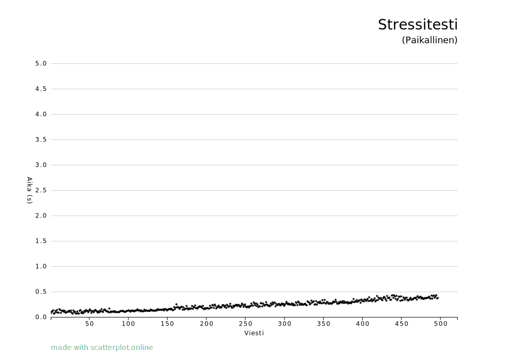
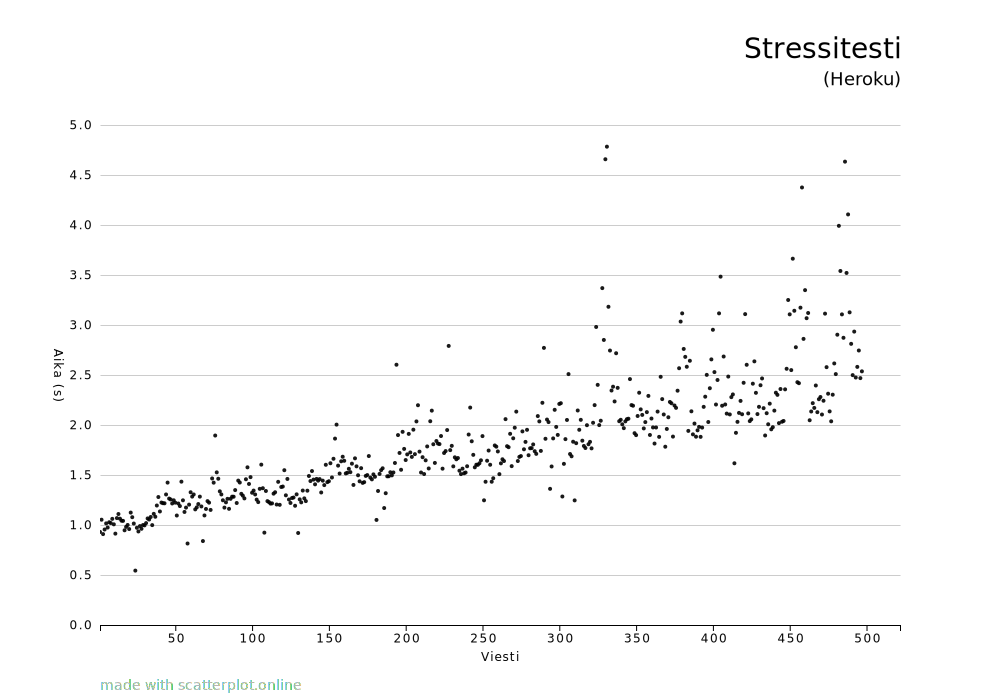

# Stressitestaus

Tein kokeen, jossa loin nettikäyttöliittymää käyttäen tuhat käyttäjää ja postasin viisisataa viestiä, joihin liitin aikaleiman. Tein tämän sekä paikallisella koneell SQLite-tietokannalla, että Herokulla PostgresSQL-tietokannalla. Testistä nähdään, että:

1. Molemmissa tapauksissa Värkin nähdään hidastuvan (ainakin liki) lineaarisesti suhteessa datan määrään. Tämä on paras mahdollinen tulos, sillä jokaisen postauksen jälkeen Värkki palauttaa etusivulle, jonne se listaa kaikki postaukset. Tämä ei voi olla lineaarista nopeampi.
2. Herokulla oli paljon hitaammat vasteajat. Tähän on monta mahdollista selitystä:
    * Puhdas verkkoviive testiä ajaneelta koneelta Herokun infraan ja takaisin
    * Herokun virtuaalikoneen laskennallinen heikkous
    * Viive herokun virtuaalikoneen ja herokun tietokantapalvelimen välillä
    * Halpa reititin

Tulokset näyttävät tältä:

Olen tuloksiin tyytyväinen, sillä ne osoittavat, ettei värkistä löydy tyhmiä pullonkauloja.
